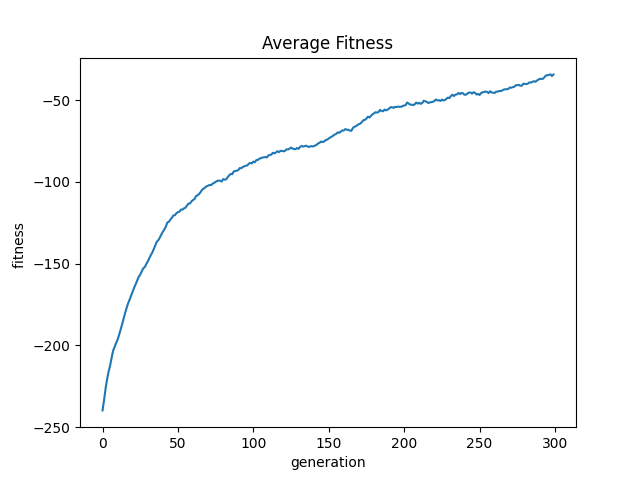
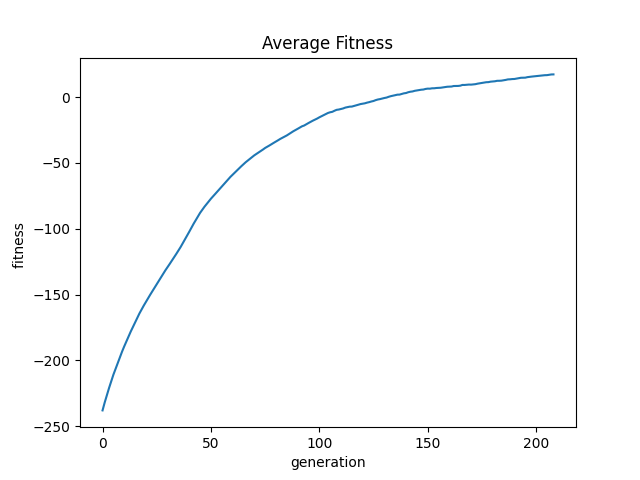

# **<u>תוכן עניינים</u>**

**מבוא3**

**תיאור הבעיה3**

**תיאור הפתרון4**

**מבט על של התוכנה7**

**הדגמת ריצה8**

**גרפים ונתונים עבור ריצות שונות10**

**מסקנות וסיכום14**

**<u>מבוא:</u>**

Movie recommender systems הינה מערכת שממליצה למשתמש על
סרטים על פי העדפה אישית.   

  
**<u>תיאור הבעיה:</u>**

בעידן של היום, בו קיימים שירותי סטרימינג וספריות וידאו
דיגיטליות עם כמויות אדירות של סרטים, נוצר צורך לבצע סינון כלשהו עבור
הצופה על מנת לספק לו את התכנים המתאימים ביותר.  
<u>  
**חלוקת הבעיה:**</u>

1.  <u>**יצירת רשימת סרטים:**  
    </u>האפליקציה צריכה לספק סרטים עליהם נוכל לבצע את הבדיקה ובסוף להציע
    למשתמש את הסרטים המתאימים לו מרשימה זו.

2.  **<u>קריטריונים:</u>**

על מנת לספק סרטים המתאימים להעדפה של המשתמש עלינו ליצור
רשימת קריטריונים אותם נוכל לדרוש לפיהם האפליקציה תקבל מידע לגבי העדפות
המשתמש.

3.  **<u>חישוב התאמה לכל סרט:</u>**

לאחר שיצרנו רשימת סרטים עלינו לחשב התאמה של כל סרט
ברשימה זו לקריטריונים שהמשתמש סיפק.

4.  **<u>חיפוש הסרטים המתאימים:</u>**

לאחר שנחשב לכל סרט את מידת ההתאמה שלו בהתאם לקריטריונים
של המשתמש נרצה להחזיר רשימה של הסרטים המתאימים ביותר.

**<u>תיאור הפתרון:</u>**

על מנת להתמודד עם הבעיה יצרנו אפליקציה שמבקשת מהמשתמש
העדפה עבור מספר קריטריונים ומחזירה לו פלט של הסרטים המתאימים ביותר.
מימוש הפתרון נעשה באמצעות ספריית Ec-Kity שמספקת
לנו גישה נוחה לעבודה עם אלגוריתמים אבולוציוניים. התוכנית תקבל רשימת
סרטים קיימים והעדפות משתמש ולאחר ביצוע אלגוריתם אבולציוני מחזירה את
הסרטים המתאימים ביותר. במימוש שלנו החלטנו לבצע אלגוריתם אבולוציוני
באמצעות וקטורים עליו נפרט בהמשך.

**<u>חלוקת שלבי הפתרון:</u>**

1.  <u>**יצירת רשימת סרטים:**  
    </u>התוכנית שולחת בקשות ל-API קיים שמבוסס על
    התוכן ב-Netflix ישראל שמתוכו אנו בונים
    database לוקאלי עדכני של סרטים.

**מגבלות:**

לא מצאנו API חינמי של סרטים,
ה-API איתו אנו עובדים מוגבל בכמות בקשות.

  
**פתרון למגבלות:**

בקשה חד פעמית של כמות מידע אפשרית מה-API ויצירת database לוקאלי.

2.  **<u>קריטריונים:</u>**

לאחר התבוננות בשדות החוזרים עבור כל סרט ב-API
איתו אנו עובדים בחרנו את השדות המתאימים ביותר לדירוג סרט
על ידי הצופה. השדות שנבחרו הינם: ז'אנר, שפת מקור, שנת יציאה מינמלית
ואורך סרט מקסימלי.  
נוסף על כך ישנה התחשבות בקריטיריון נוסף שאינו תלוי במשתמש וזהו קריטריון
דירוג הסרט ב-IMDB.

**חישוב ציון לכל סרט:**<u>  
</u>לאחר שהמשתמש סיפק את המידע הדרוש בהתאם לשדות המתאימים מתבצע חישוב
ציון ההתאמה עבור כל הסרטים, חישוב זה מבוצע פעם אחת שבסופו נקבל
בחזרה

וקטור - movieScores, בו כל אינדקס
מייצג את ציון הסרט המתאים לו ברשימת הסרטים.

**פירוט חישוב הציון לכל סרט:  
**בתחילת העבודה על הפרוייקט קבענו חלוקה שווה לכל אחד מהפרמטרים אך לאחר
קבלת תוצאות רבות שאינן רלוונטיות נתנו למשתמש שתי אפשרויות חדשות:  
1. לבצע את­­ התיעדוף לכל קריטריון בעצמו.

2. לעבוד עם חלוקה דיפולטיבית (עליה אנו ממליצים).

  
החישוב מתבצע באמצעות הפונקציה grading_movies,
שמקבלת כארגומנטים את תיעדוף הקריטריונים של המשתמש ,רשימת הסרטים ומספר
הז'אנרים שנבחרו על ידי המשתמש.  
הפונקציה מבצעת חישוב קבוע מראש על פי החלוקה לאחוזים שנקבעה על ידי המשתמש
תוך כדי התייחסות גם לדירוג הסרט ב-IMDB.  
סך כל העדפות המשתמש מקבל נקודה 1 ודירוג הסרט IMDB מקבל נקודה 1, סה"כ הציון הגבוה ביותר שסרט יכול לקבל הוא 2
נקודות.

3.  **<u>חיפוש הסרטים המתאימים:</u>**

לאחר שיצרנו את הווקטור movieScores אנו מתחילים בשלב האלגוריתם האבולוציוני.  
האלגוריתם מייצר initial-population שמורכבת
מ-individuals, כאשר כל individual מאותחל באופן אקראי. Individual הוא
וקטור של ביטים (0 עבור אי-המלצה ו-1 עבור המלצה)
שאורכו כמספר הסרטים הכולל וכל אינדקס בו מתאים לאינדקס של סרט
ב-movieScore.

לכל individual נרצה לבצע חישוב
של fitness שזהו למעשה חישוב התאמה מיטבית למערך
אשר מתבסס על ציוני ההתאמה ב-movieScores.

נשים לב כי מדובר בבעיית מקסימום עליה נפרט בהמשך.

**חישוב fitness:**

  
נשתמש במחלקה movieEvaluator הממששת את
הפונקציה evaluate_individual().  
המחלקה מקבלת כארגומנטים את הווקטור movieScores ואת השדה lowerBoundGrade המייצג את ציון
ההתאמה הנמוך ביותר שאנו מגדירים כמספק. בקוד שלנו בחרנו
lowerBoundGrade = 1.5, הסיבה לכך היא על מנת להבטיח כי גם
סרט שמדורג עם הציון הכי גבוה שניתן לבחור (100), יקבל תוצאה טובה שתאפשר
לו להכנס לרשימה אך ורק אם אחוז ההתאמה שלו לקריטריונים של המשתמש הוא
לפחות 50 אחוז.

הפונקציה evaluate_individual() רצה באופן הבא:

  
לכל אינדקס i בווקטור individual המייצג סרט:

אם הסרט ב-movieScores\[i\] גדול
שווה ל-lowerBoundGrade אז נכפול את הציון

> ב-individual\[i\].  
> אחרת, נכפול את individual\[i\] בערך שלילי של
> תוצאת חיסור הציון מפרמטר הניקוד (נקודה אחת עבור דירוג הסרט ונקודה
> נוספת עבור הקריטריונים של המשתמש).  
> באופן זה כל הסרטים שלא עברו את סף ה- lowerBoundGrade dir="rtl">יקבלו ציון שלילי אך סרטים שקרובים יותר לסף יקבלו ציון גבוה
> יותר (קרוב יותר ל-0) מאשר סרטים שרחוקים מהסף.
>
> נחבר את הערכים שהתקבלו מכל איטרציה והערך הסופי מייצג
> את ה-fitness. נרצה לקבל ציון הכי גבוה עבור
> ה-fitness לכן הגדרנו higher is better =
> true.
>
> **genetic operators:**
>
>   
> השתמשנו בשני סוגי ה-genetic operators  dir="rtl">הבסיסיים CrossOver  dir="rtl">ו-Mutation.בהרצות הראשונות עבדנו
> עם data base קטן יחסית (כ-30 סרטים) ועבור הכמות
> הזו השתמשנו ב:  
> VectorKPointsCrossover  dir="rtl">ו-BitStringVectorNFlipMutation  dir="rtl">הנתונים בחבילה Ec-Kity.  
> 
>
> עבור מספר סרטים קטן קיבלנו תוצאות טובות בשימוש עם
> ה- genetic operatorsהללו.
>
> לאחר הגדלת ה-data base הגענו
> למספר של כ-560 סרטים ונתקלנו בבעיה להגיע לתוצאה מיטבית.
>
> לאחר מספר ניסויים שמנו לב כי הגדלת האוכלוסייה מסייעת
> להגיע לתוצאה טובה יותר, אך ככל שהגדלנו את האוכלוסייה נתקלנו בחישובים
> כבדים יותר שלקחו המון זמן.  
> על מנת להימנע מחישובים כבדים עקב גישת הגדלת האוכלוסייה החלטנו לנסות
> לבצע שינוי באופן הפעולה של ה- genetic operators dir="rtl">בהם אנו משתמשים. תחילה ניסינו ליצור Crossover  dir="rtl">חדש:

- <u>VectorKPointsCrossoverStrongestCross</u>:

>   
> ניסיון ראשון:
>
> בתהליך הזה אנו בוחרים נקודה רנדומלית בה נחלק כל אחד
> מההורים באופן דומה לחלוקה ב- VectorKPointsCrossover  dir="rtl">ונבדוק מיהו הווקטור הטוב ביותר הנוצר מבין השניים הבאים:  
> ילד שנוצר מהחלק הימני של הורה 1 והחלק השמאלי של הורה 2,

ילד שנוצר מהחלק הימני של הורה 2 והחלק השמאלי של הורה
1.

התהליך שיפר במקצת את התוצאות אך עדיין לא הגיע לתוצאה
מספקת.

> ניסיון שני:
>
> בתהליך הזה אנו בוחרים נקודה רנדומלית בה נחלק כל אחד
> מההורים בצורה דומה לחלוקה ב- VectorKPointsCrossover dir="rtl">, בשונה מהניסיון הראשון הפעם נתבונן גם בהורים ונבדוק מיהו
> הוקטור הטוב ביותר הנוצר מבין הארבעה הבאים:  
> הורה 1,  
> הורה 2,  
> ילד שנוצר מהחלק הימני של הורה 1 והחלק השמאלי של הורה 2,
>
> ילד שנוצר מהחלק הימני של הורה 2 והחלק השמאלי של הורה
> 1.  
>   
> התהליך גם שיפר את התוצאות אך עדיין לא בצורה מספקת.

לאחר שיצירת VectorKPointsCrossoverStrongestCross
לא סיפק פתרון מיטבי לבעיה החלטנו לייצר גם
Mutation operator חדש –
PrioritizedBitStringVectorNFlipMutation.

- <u>PrioritizedBitStringVectorNFlipMutation:</u>

> בתהליך זה נבצע bit-mutation  dir="rtl">בצורה הסתברותית בדומה לדרך בה פועל
> BitStringVectorNFlipMutation אך בשונה ממנו, לאחר
> הבחירה ההסתברותית אם נבחר לבצע bit-flip נפעיל
> שני אילוצים נוספים:

1.  אם individual\[i\]=1 וגם
    קיבלנו תוצאה שווה גדולה ל- lowerBoundGrade לא
    נבצע bit-flip.

2.  אם individual\[i\]=0 וגם
    קיבלנו תוצאה מתחת ל-lowerBoundGrade לא
    נבצע bit-flip.

> לאחר הוספת
> PrioritizedBitStringVectorNFlipMutation התוצאות
> שקיבלנו השתפרו לרמת פלט מספקת גם במימוש עם
> VectorKPointsCrossoverStrongestCross אותו יצרנו וגם
> במימוש VectorKPointsCrossover שהיה קיים
> בחבילת Ec-Kity.
>
> **Selection:**

בחרנו להשתמש ב-tournament selection בגודל 2 ו-higher is better = true.  

**<u>מבט על של התוכנה:</u>**

התוכנה מבצעת אתחול של ה-data base (במידה ולא קיים) באמצעות הפונקציה load_movies.

התוכנה מקבלת מהמשתמש מידע לגבי דירוג הקריטריונים.

התוכנה מבצעת חישוב של דירוג הסרטים על סמך דירוג המשתמש
באמצעות הפונקציה grading_movies.

התוכנה מבצעת אתחול של האלגוריתם.

התוכנה מבצעת algo.evolve() ותתחיל
את ריצת האלגוריתם האבולוציוני.

התוכנה תריץ את algo.execute() ותשמור את וקטור הפלט הטוב ביותר ב-result.

במידה והאלגוריתם לא מצא סרטים מתאימים נאפשר למשתמש
להכניס קריטריונים חדשים.

במידה והאלגוריתם מצא לפחות סרט אחד נחזיר למשתמש רשימת
סרטים אפשריים אחרת נאפשר למתשמש להזין נתונים
חדשים.

**<u>הדגמת ריצה:</u>**

המשתמש מקבל אפשרות לבחור האם להזין בעצמו את המשקל לכל
קריטריון או להחליט על המשקל בעצמו.

נבצע ריצה עם ההמלצה שלנו:

המשתמש יבחר ז'אנר רצוי (אחד או יותר) ולאחר כל בחירה של
ז'אנר ילחץ על enter. לאחר שסיים לבחור את כל
הז'אנרים המשתמש יזין למסך את המילה ‘finish’ ולאחר
מכן ילחץ על enter.

המתמש יבחר שפת מקור רצויה (אחת או יותר) באופן זהה לבחירת
הז'אנר.

כעת המשתמש יבחר שנת יציאה מינימלית ואורך סרט
מקסימלי.

האלגוריתם יעצור במידה והגיע להתאמה לפי
ה-threshold  (בקוד שלנו בחרנו 80 אחוז התאמה,
כלומר threshold = 0.2 \* max_fitness).

בסיום ריצת האלגוריתם האבולוציוני התוכנית תדפיס רשימה של
כל הסרטים המומלצים בהתאם לקריטריונים ודרישת המשתמש (במידה ולא נמצאו כאלה
התוכנית תציע למשתמש להתחיל את התהליך מחדש).

**<u>גרפים ונתונים עבור ריצות שונות:</u>**

**בכל דוגמאות ההרצה השתמשנו בנתונים זהים:**  
population_size=300 (שונה רק בריצה מספר 3)  
MAX_GENERATION = 300

Genres: 10749, 35  
Original language = en  
Min year = 2000  
Max length = 130

\*תזכורת – האלגוריתם יעצור לפני הגעה
ל-MAX_GENERATION אם מדד ה-fitness גדול או שווה ל-80% מ-max fitness.

**ריצה 1** – data base קטן של
סרטים עם VectorKPointsCrossover ו-BitStringVectorNFlipMutation:

Max fitness = 4.54  
matched movies = 3  
Best fitness = 3.72  
total movies in DB: 88  
recommended movies in DB: 4

**ריצה 2** – data base גדול של
סרטים עם VectorKPointsCrossover ו-BitStringVectorNFlipMutation:

Max Fitness = 31.11  
matched movies = 20  
Best Fitness = -27.540000000000003  
total movies in DB: 568  
recommended movies in DB: 86

**ריצה 3**
– data base גדול של סרטים עם
VectorKPointsCrossover ו-BitStringVectorNFlipMutation עם הגדלה
של ה-initial population:

<u>שינוי אוכלוסייה מ-300 ל-5,000:</u>

Max fitness = 31.11  
matched movies = 20  
Best fitness = 19.28  
total movies in DB: 568  
recommended movies in DB: 33

<u>שינוי
אוכלוסייה ל-10,000:</u>

Max fitness = 31.11  
matched movies = 20  
Best fitness = 25.28  
total movies in DB: 568  
recommended movies in DB: 27

**ריצה 4** – data base
גדול של סרטים עם
VectorKPointsCrossoverStrongestCross 
ו-BitStringVectorNFlipMutation:

Max fitness = 31.11  
matched movies = 20  
Best fitness = -30.239999999999995  
total movies in DB: 568  
recommended movies in DB: 90

**ריצה 5** – data base
גדול של סרטים עם VectorKPointsCrossover  ו- PrioritizedBitStringVectorNFlipMutation:

Max
fitness = 31.11  
matched movies = 20  
Best fitness = 25.439999999999998  
total movies in DB: 568  
recommended movies in DB: 21

**ריצה 6** – data base
גדול של סרטים עם
VectorKPointsCrossoverStrongestCross  ו-
PrioritizedBitStringVectorNFlipMutation:

Max fitness = 31.11  
matched movies = 20  
Best fitness = 24.830000000000002  
total movies in DB: 568  
recommended movies in DB: 16

**<u>מסקנות וסיכום:</u>**

**נסכם את השינויים מריצה לריצה:**  
ריצה 1: קיבלנו תוצאה רצויה (מעל 80% אחוז התאמה) לאחר 40 דורות.  
ריצה 2: קיבלנו תוצאה לא רצויה, וכפי שניתן לראות קצב העלייה הופך לאיטי
יותר לאחר מספר דורות.  
ריצה 3: גם לאחר העלת האוכלוסייה לגודל של 5,000 עדיין לא הגענו לתוצאה
רצויה לאחר 300 דורות, עם זאת בריצה של אוכלוסייה בגודל של 10,000 הצלחנו
להגיע לתוצאה רצויה לאחר כ-200 דורות. ניתן לראות כי הגדלת האוכלוסייה
משפרת את התוצאה ואף עבור אוכלוסייה גדולה מספיק התוצאה הרצויה מתקבלת גם
לאחר פחות מ-300 דורות.  
ריצה 4: קיבלנו תוצאה לא רצויה, בדומה לריצה מספר 2, קצב העלייה הופך איטי
יותר לאחר מספר דורות.  
ריצות 5 ו-6: בשתי הריצות הללו קיבלנו תוצאה רצויה, ריצה 5 הצליחה לעצור
לאחר 100 דורות וריצה 6 לא עצרה לאחר 100 דורות אך ניתן להבחין לפי הגרף כי
החל מדור 150 לא היה שינוי בערך ה-fitness והתוצאה
מאוד קרובה ל-80% התאמה.  
כמו כן ניתן להבחין כי בריצה 6 קצב העלייה בין הדורות 0 ל-100 מהיר יותר
מקצב העלייה בריצה 5, כלומר שתי הריצות מגיעות לתוצאה הרצויה, אך ריצה 6
מגיעה לתוצאה זו בקצב מהיר יותר בעקבות השימוש ב-
VectorKPointsCrossoverStrongestCross שמתעדף את וקטור
הקרוס-אובר הטוב ביותר.

כפי שניתן לראות מהריצות השונות, עבור קלט קטן התוכנית
מצליחה להגיע לתוצאות טובות בשימוש עם VectorKPointsCrossover ו-BitStringVectorNFlipMutation. אך כאשר
גודל הקלט עולה יש צורך להגדיל את גודל האוכלוסייה על מנת לשפר את התוצאות
של התהליך האבולוציוני. (ניתן גם לבצע שינוי בכמות הדורות על מנת לאפשר
איטרציות נוספות בניסיון לשפר את איכות הפלט)

עם זאת הגדלת אוכלוסייה היא פתרון בעייתי, שכן ככל שכמות
הסרטים תגדל כך נצטרך גם להגדיל את כמות האוכלוסייה בהתאם. פתרון זה אינו
יעיל ודורש חישובים כבדים ומחשבים חזקים יותר.

לסיכום לאחר הרצת כל ששת סוגי הריצה השונים מספר רב של
פעמים, ניתן להסיק כי הפתרון היעיל ביותר הוא שימוש ב-
PrioritizedBitStringVectorNFlipMutation שמבצע מוטציות רק
כאשר המוטציה משפרת את ה-fitness של הווקטור. גישה
זו נותנת תוצאות זהות גם עבור VectorKPointsCrossover וגם עבור VectorKPointsCrossoverStrongestCross גם כאשר גודל האוכלוסייה נשאר נמוך (300).

